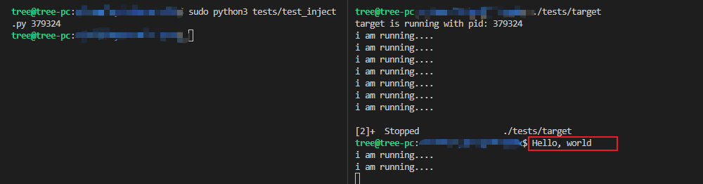
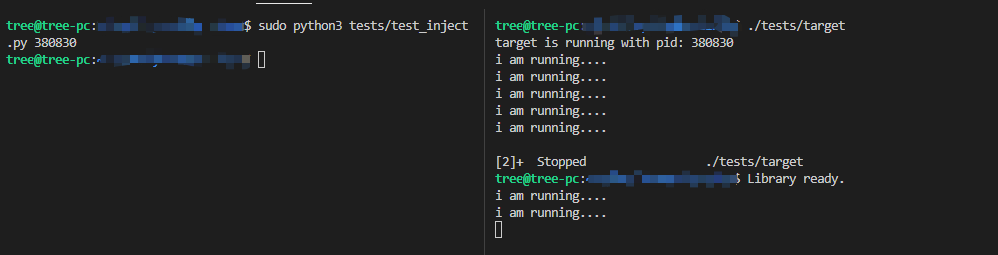
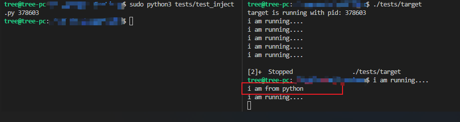
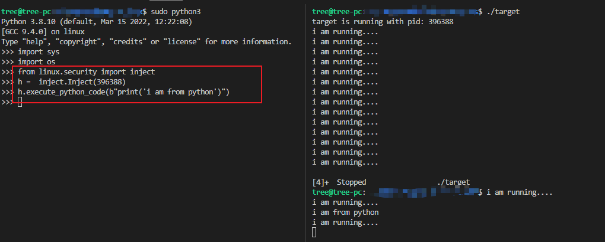
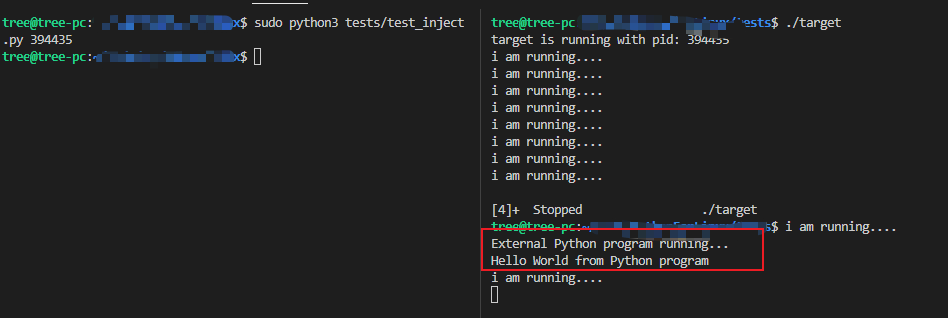
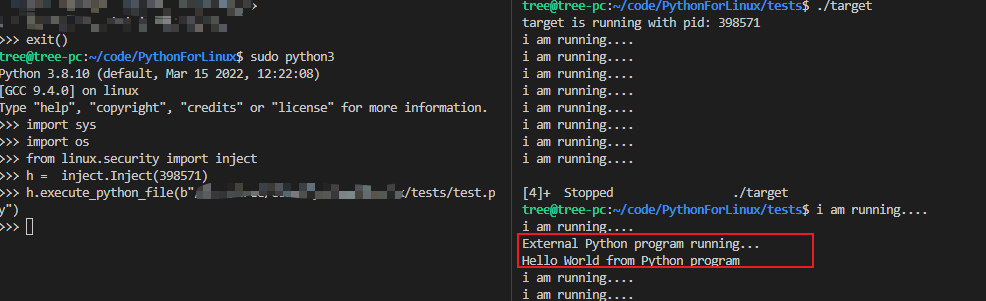

### Inject Linux Process Without ptrace

#### 注入Shellcode
##### 前期准备
* 利用`signal`将target进程挂起
* 通过`/proc/[pid]/syscall`获取进程的寄存器信息（RIP/RSP）
* 通过`/proc/[pid]/mem`文件，备份将要修改的内容（栈）
* 写入`/proc/[pid]/mem`文件，修改当前`rip`内容指向写入的`Stage 1`地址
* Stage 1
    *  备份进程状态（上下文寄存器）
    *  利用`mmap`为Stage2分配地址，将Stage2 shellcode写入地址
    *  跳转到Stage2的shellcode

* Stage 2
    * 恢复进程原有状态
    * povit stack（这样不会影响进程原堆栈）
    * 执行shellcode
    * 恢复寄存器状态 / 恢复栈状态 / 返回Stop前地址继续执行

* demo

#### 注入库
* 前期准备和Stage相同，Stage2有些区别
* Stage2
    * 恢复进程原堆栈状态
    * povit stack（这样不会影响进程原堆栈）
    * 调用`dl_open`加载指定的库文件（库文件定义的构造函数将被执行）
    * 恢复进程寄存器、堆栈状态，跳转回`SIGSTOP`前状态
* demo

#### 注入Python代码

* 通过上述注入库的方式向target进程注入python解释器库文件
* 生成通过libpython执行要注入的python代码的shellcode（这里是直接执行一条python语句）
* 注入shellcode代码执行
* demo

#### 注入Python文件
* 通过上述注入库的方式向target进程注入python解释器库文件
* 生成通过libpython执行要注入的python代码的shellcode（这里执行任意python文件）
* 注入shellcode代码执行
* demo

### Refer
* [Embedding Python In C](https://www.linuxjournal.com/article/8497)
